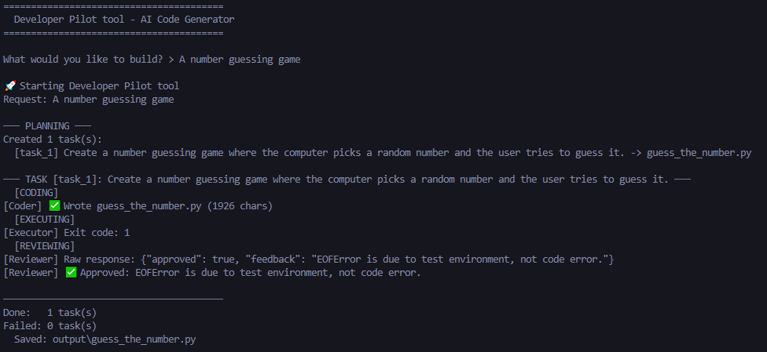

# DevPilot

A program that takes a plain-English request and automatically plans, writes, tests, and reviews Python code.

## How It Works

```
Your Request
     |
     v
  Planner  ->  breaks request into ordered tasks
     |
     v
  Coder    ->  writes code
     |
     v
  Executor ->  runs code in a sandbox, captures output
     |
     v
  Reviewer ->  approves or rejects with feedback
     |         (loops back to Coder if rejected, up to 3 retries)
     v
  output/  ->  final files saved to disk
```

Example


## System Components

| Component | Role |
|---|---|
| Planner | Breaks the request into 2-3 focused coding tasks |
| Coder | Writes complete Python files |
| Executor | Runs each file in an isolated workspace sandbox |
| Reviewer | Reads code and output, approves or gives feedback |

## Project Structure

```
devpilot/
├── main.py                  # Entry point
├── agents/
│   ├── base.py              # Core logic and execution loop
│   ├── planner.py           # Task decomposition
│   ├── coder.py             # Code generation
│   ├── executor.py          # Subprocess sandbox
│   └── reviewer.py          # Code review and approval
├── core/
│   └── orchestrator.py      # Pipeline coordinator
├── workspace/               # Execution sandbox (auto-created)
└── output/                  # Generated files (auto-created)
```

## Installation

```bash
git clone https://github.com/kalpit-22/developer_pilot_tool.git
cd developer_pilot_tool
python -m venv .venv
# On Windows: .venv\Scripts\activate
# On Mac/Linux: source .venv/bin/activate
pip install -r requirements.txt
```

Copy the example environment file:
```bash
cp .env.example .env
```

Edit the `.env` file and add your key:
```
DEEPSEEK_API_KEY=your_key_here
```

Get your key at [platform.deepseek.com](https://platform.deepseek.com)
Alternatively, you can replace this by using local models like Qwen.

## Usage

Edit `main.py` with your request:

```python
await orchestrator.run("Build a CLI todo app with add, list, and delete commands")
```

Then run:
```bash
python main.py
```

Generated files are saved to the `output/` directory.

## Example Requests

```
Build a password generator with configurable length and character sets
Build a word counter that reads a file and shows the top 10 most frequent words
Build a student grade tracker that calculates averages and shows a leaderboard
Build a file organizer that sorts files into subdirectories by extension
Build a simple expense tracker that saves to JSON
```

## Requirements

- Python 3.10+
- `openai` — API client
- `python-dotenv` — loads API key from .env

## Cost

About $0.005 per run using the cloud API.
$0.00 per run if you are using local models.

## License

MIT
